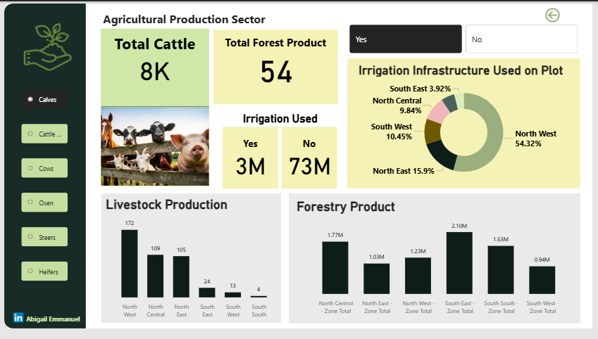

# Agricultural Household Survey — Power BI Project

**Overview:**  
This Power BI project analyzes agricultural household survey data (NASS), focusing on agricultural holdings, plot characteristics, household activities, and production levels.  
Raw data is confidential and **not included**. This repository contains only dashboard screenshots and project documentation.

---

## Project Contents
- `screenshots/` Dashboard images (no raw data)
- `docs/` Project scope and notes (AREA OF CONCENTRATION.docx)

---

## Dashboard Screenshots

### 1. Dashboard Overview  
*High-level summary of agricultural households across zones.*  

### 2. Householding  
*Details of agricultural household distributions and activities.*  

### 3. Plot / Area  
*Insight into plot types, conventional vs fallow plots, irrigation, and land area.*  

### 4. Production  
*Crop production, harvested seasons (major/minor), livestock and aquaculture participation.*  

---

## Tools Used
- **Power BI Desktop** – Data cleaning and preparation (not uploaded), Modeling, analysis, and visualization  
 

---

## Data Privacy
Raw NASS data is confidential and has **not** been uploaded.  
Only **non-sensitive screenshots** and **documentation** are included to demonstrate analytical workflow.

